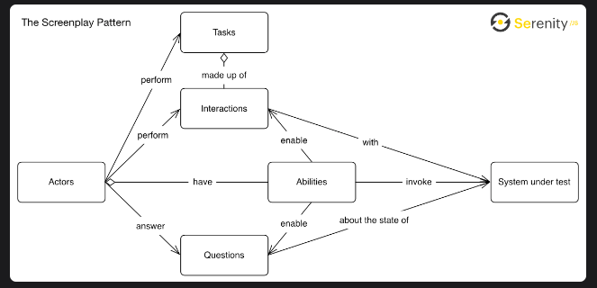

# Screenplay Design Pattern Proof of Concept (PoC)



This Proof of Concept (PoC) is designed to illustrate the power of the Screenplay design pattern. It is built on the Screenpy library while keeping the implementation concise and efficient.

## Prerequisites

Before running the tests, you'll need to set up your environment:

1. Create a Python virtual environment:

   ```bash
   python -m venv venv
   source venv/Scripts/activate```

2. Install the required packages:
    ```
    pip install -r requirements.txt
    ```

3. Configure your environment variables by adding your Trello credentials to the .env file:
    ```
    USER=''
    PASSWORD=''
    ```

## Running the Tests

To execute the tests, use the following commands:

1. For the test using individual actions:
    > python src/test.py

2. For the test using tasks to combine actions (Login, CreateBoard, and DeleteBoard):
    >python src/test_using_tasks.py

## Additional Resources

For more information about the Screenplay design pattern, Screenpy, and Screenpy-Selenium, 
please refer to the following links:

### POM vs ScreenPlay - A comparative analysis of Page Object Pattern and Screenplay:

> https://www.linkedin.com/pulse/page-object-pattern-vs-screenplay-comparative-analysis-callum-porter/?trackingId=vOsrIu5pSp2o6B8tNznGaQ%3D%3D

### Screenpy Documentation - Learn more about Screenpy:

> https://screenpy-docs.readthedocs.io/en/latest/
> https://screenpy-selenium-docs.readthedocs.io/en/latest/index.html

### configuration to pylint report 
> https://github.com/Exirel/pylint-json2html

### Configuration of api request trigger(dispatch events)
> https://docs.github.com/en/rest/actions/workflows?apiVersion=2022-11-28#create-a-workflow-dispatch-event

## PoC Overview

In this PoC, I've implemented the Screenplay design pattern using the base Screenpy library. 
I've created custom tasks, abilities, actions, questions, resolution, and an actor class. 
These classes contain only the necessary methods for the PoC.

The PoC is centered around testing Trello and includes the following scenarios:

1. Login to Trello
2. Create a Trello Board
3. Delete a Trello Board

I've provided two test cases:

1. The first test case utilizes individual actions to perform the scenarios.
2. The second test case demonstrates how tasks can be used to combine actions for more complex scenarios, 
specifically for logging in, creating a board, and then deleting it.


        
https://dashboard.render.com/web/srv-clr9jmggqk6s7394br8g

https://workflowtrigger.onrender.com/
